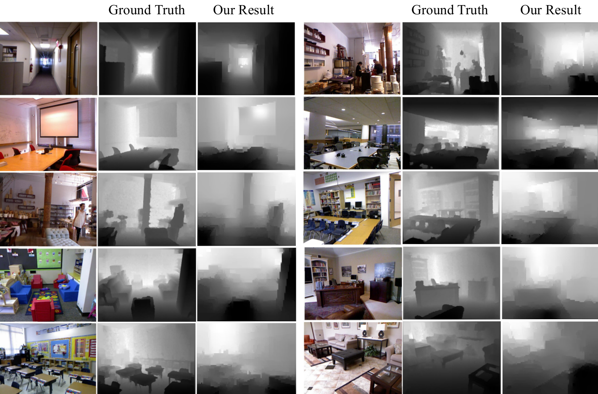

# Size To Depth
Yiran Wu, Sihao Ying, Lianmin Zheng

## Abstract

We consider the problem of single monocular image
depth estimation. It is a notoriously challenging problem
due to its ill-posedness nature. Previous efforts can be
roughly classified into two families: learning-based method
and interactive method. The former, in which deep convolutional neural network (CNN) is adopted frequently, leads to
considerable results on specific dataset, but perform poorly
on images outside the dataset, which shows its lack of extensiveness. Besides, plenty of data are needed to train
the model. The latter requires human annotation of depthwhich, however, is easily to have large errors.
To overcome these problems, we propose a new perspective for single monocular image depth estimation problem:
size to depth. Most previous interactive methods try to obtain depth labels directly from human. Different from these
methods, our method receives object size labels from human
as prior. Depth can be inferred through simple geometric
relationships given size labels. Then we design a conditional random field (CRF) model to propagate depth 
information and finally generate the whole depth map. We experimentally demonstrate that our method outperforms 
traditional depth-labeling methods and can produce satisfactory
depth maps.

## Demo
<iframe src="https://www.youtube.com/embed/jliea54nNFM" frameborder="0" allow="autoplay; encrypted-media" allowfullscreen></iframe>

## Author
<table style="width:100%" align="center" border="0">
  <tr style="border-style:hidden">
     <th style="border-style:hidden"></th>
     <th style="border-style:hidden"></th> 
     <th style="border-style:hidden"></th>
  </tr>
  <tr style="border-style:hidden">
     <th style="border-style:hidden"> <a href="https://github.com/Yiranwu">Yiran Wu</a></th>
     <th style="border-style:hidden"> <a href="https://github.com/yingsihao">Sihao Ying</a></th>
     <th style="border-style:hidden"> <a href="https://github.com/merrymercy">Lianmin Zheng</a></th>
  </tr>
</table>

## Code & Paper
View code on [Github](https://github.com/Yiranwu/Size2Depth).  
View paper on [Here](https://github.com/Yiranwu/Size2Depth/blob/master/res/paper.pdf).  
